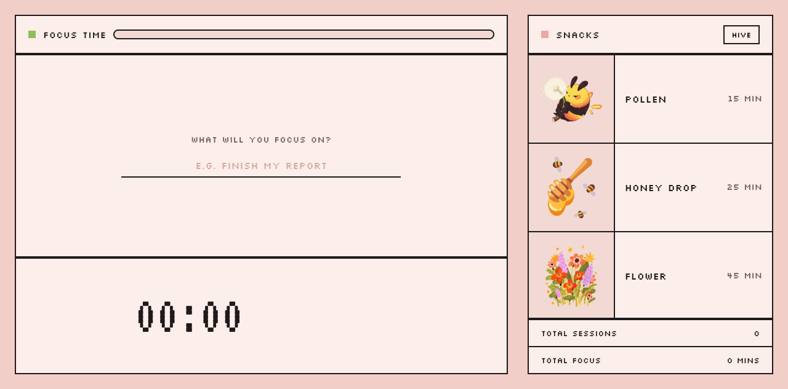

# Beemodoro

A pixel-art Pomodoro/focus-timer app with a bee mascot: drag a snack onto the bee to start a focus session, watch its mood change as you work, and fill in a honeycomb of completed sessions over the semester. Built as a small offline Electron desktop app, the sibling to **[Todobee](https://github.com/MellyMarcelia/todobee)** (a to-do list app with the same bee theme).



Beemodoro logs every session event (started / completed / cancelled) as plain, human-readable markdown into an Obsidian vault of your choosing: an honest, append-only record you actually own, not locked into the app. See `PRD.md` in this repo for the full product spec, technical decisions, and acceptance criteria.

## Requirements

- [Node.js](https://nodejs.org/) 20 or newer (tested on Node 22)
- npm (comes with Node)
- macOS, Windows, or Linux (developed and tested on macOS)
- Optional: an [Obsidian](https://obsidian.md/) vault (any folder) if you want session events logged to markdown

## Setup

```bash
git clone https://github.com/MellyMarcelia/beemodoro.git
cd beemodoro
npm install
npm run dev
```

That's it: `npm run dev` starts the app in development mode with hot reload. No extra configuration, accounts, or API keys are needed; Beemodoro works fully offline out of the box.

### Running the tests

```bash
npm test
```

Runs the full Vitest suite (main-process logic: session timer/duration behaviour including pause/resume and crash recovery, Obsidian logging format, and settings) headlessly; no running app required.

### Other useful scripts

```bash
npm run typecheck   # TypeScript, both main and renderer
npm run lint        # ESLint
npm run build       # production build (electron-vite)
npm run build:mac   # packaged macOS app (also build:win, build:linux)
```

## Using the app

1. Type what you're focusing on in the left panel (required: the field must not be empty; trying to start a session without one shows an inline error).
2. Drag a snack icon from the right-hand tray onto the description field (or, once a session/break is active, onto the bee), or just click a snack row, to start a session of that snack's duration. A progress bar in the "Focus Time" header fills as the session runs.
3. While focused, the bee buzzes; **Pause** freezes the timer (excluded time never counts toward the logged duration) and switches the bee to its paused pose; **Resume** picks up where you left off.
4. The reset/cancel button next to the timer cancels the session; you'll be asked to confirm first. A cancelled session ends permanently (no resuming) and fills a cracked cell in the honeycomb. It's only shown while there's actually something to cancel (a running/paused session, or a break in progress).
5. Letting the timer run out completes the session, the bee turns happy, a coloured honeycomb cell fills in, and a **Take a break** button appears; pressing it starts a break of the configured length (default 5 minutes; adjustable in Settings) with the bee switching to its break pose and the header progress bar refilling in a different colour. Breaks are not logged and don't get a honeycomb cell, and can be cancelled early with the same reset button.
6. Click **Hive** in the right panel to see the full honeycomb history plus a filterable list (by date, description, snack, and status); click **Back** to return to the snack tray.
7. The stats box under the snack tray always shows your lifetime total sessions and total focus minutes, computed live from real completed sessions.

## Settings (Cmd+, / Ctrl+,)

Press **Cmd+,** (macOS) or **Ctrl+,** (Windows/Linux) from anywhere in the app to open Settings:

- **Obsidian vault folder**: click **Choose vault folder** and pick any folder on disk.
- **Snack durations**: adjust minutes for Pollen, Honey drop, Flower, and Honey jar; changes apply to the *next* session started with that snack.
- **Break length**: adjust the break duration in minutes; applies to the *next* break started.

If you skip choosing a vault, Beemodoro still works completely normally; you just won't get a vault log, and a banner reminds you logging isn't set up yet. If a previously chosen folder later goes missing (moved, deleted, external drive unplugged), Beemodoro still works and shows a different warning telling you the folder can't be found.

### Vault folder structure

Beemodoro writes one append-only markdown file per calendar day, under its own top-level folder in the vault:

```
<your vault>/
  Beemodoro/
    Focus/
      2026/
        2026-09/
          2026-09-27.md
          2026-09-28.md
```

Nothing is ever overwritten or rewritten: every event is appended as a new line, even across app restarts and crashes. If Todobee (the sibling app) is pointed at the same vault, its own logs live alongside this in a separate `Todobee/Tasks/...` folder; the two never touch each other's files.

### Example log line

Each line is a single markdown bullet with the full date, time, and timezone inline (never only implied by the filename), plus the event type, status, snack and its duration, the session's description, and, for completed/cancelled sessions, the actual (non-paused) duration:

```markdown
- **2026-09-27 14:32:07 (Europe/Brussels, UTC+02:00)** -- `session.started` -- Status: running -- Honey drop (25 min) -- Description: "Build honeycomb view"
- **2026-09-27 14:57:07 (Europe/Brussels, UTC+02:00)** -- `session.completed` -- Status: completed -- Honey drop (25 min) -- Description: "Build honeycomb view" -- Duration: 25m00s
- **2026-09-27 15:10:41 (Europe/Brussels, UTC+02:00)** -- `session.cancelled` -- Status: cancelled -- Pollen (15 min) -- Description: "Read one paper" -- Duration: 4m12s
```

## Crash recovery

If Beemodoro is force-quit or crashes while a session is running or paused, the next launch automatically closes that session as `cancelled`, using the last elapsed-seconds value persisted to SQLite (persisted every few seconds while a session runs); no session is ever silently lost, and a `session.cancelled` line is written to the vault log for it.

## Resetting your local data

Beemodoro stores all its data in one SQLite file, completely separate from your Obsidian vault (the vault only ever receives a write-only markdown export; it's never read back).

**macOS:** `~/Library/Application Support/beemodoro/beemodoro.db` (plus `beemodoro.db-wal` / `beemodoro.db-shm`, its write-ahead-log companions; always keep all three together)
**Windows:** `%APPDATA%\beemodoro\beemodoro.db`
**Linux:** `~/.config/beemodoro/beemodoro.db`

To reset your data **without deleting anything**, so you can always undo it:

1. Fully quit Beemodoro first (a running app can still have the file open).
2. Rename the file rather than deleting it, e.g.:
   ```bash
   mv ~/Library/Application\ Support/beemodoro/beemodoro.db ~/Library/Application\ Support/beemodoro/beemodoro.db.backup-$(date +%Y%m%d)
   ```
   Do the same for the `-wal` and `-shm` files if present.
3. Launch Beemodoro again; it will create a brand-new, empty database at the same path automatically.
4. If you ever want your old data back, quit the app, delete/move away the new file, and rename your backup back to `beemodoro.db` (with its `-wal`/`-shm` companions, if you kept them).

Your Obsidian vault logs are never touched by any of this; they're a separate, independent history.

## Credits

- **Fonts:** [Silkscreen](https://fonts.google.com/specimen/Silkscreen) (labels/buttons) and [VT323](https://fonts.google.com/specimen/VT323) (timer numerals), both via Google Fonts, licensed under the [SIL Open Font License](https://scripts.sil.org/OFL).
- **Bee mood art** (`src/renderer/src/assets/bee/`, background removed, converted to WebP): "Bee Bebel" (focus), "Happy Feliz" (completed), "Happy Feliz" #2 (break), "Sad Bee" (cancelled), and "Scared Bee" (paused) GIFs by PlayKids, sourced from Giphy. Untouched originals kept in `reference/bee-assets/`.
- **Snack tray icons** (`src/renderer/src/assets/snacks/`, background removed, cropped, converted to WebP): illustrations provided by the author (Pollen, Honey drop, Flower, Honey jar). Untouched originals kept in `reference/snack-assets/`.
- App icon, all UI/UX design, and all code: built by the author for this project.

If you're the above asset creator and would like different credit or removal, please open an issue.

## Known limitations / not built in this pass

See `BUILD-NOTES.md` for the full manual test checklist and a list of anything skipped or left for follow-up.
